# Setup
I dont like working with notebooks a lot, so I moved the experiment code into a normal Python script (notebooks/experiment.py). It's easier for me to edit one config block at the top, run it from the terminal, and get the markdown output ready to paste here. It also means each entry in this log matches exactly one run of the script, so I can always tell which config produced which result.

# Approach
As there are several parameters to play around with and i was not sure how to deal with this in the best way. So I decided to optimise one parameter at a time. And at the end try some random changes. For that I thaugt about what would be the best order to do this. And after some reseach I decided for this one:

## Parameter adjustment order
1. Width
2. Depth
3. Optimizer
4. Epochs
5. Activation function

# Experiments

## EXP-0 Baseline

I am going to run the default 3 times with the same parameters. To check if they retrun consistent results

### Run EXP-0.1

**Config**
- Hidden layers: [2]
- Activation: relu
- Optimizer: sgd
- Epochs: 50
- Batch size: 32

**Results**
- Train accuracy: 0.622
- Test accuracy: 0.592
- Precision: 0.000
- Recall: 0.000
- F1: 0.000

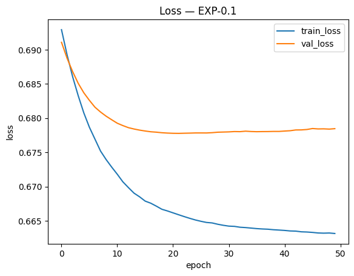

**Confusion matrix**

|  | Predicted Dead | Predicted Survived |
|---|---|---|
| **Actual Dead** | 106 | 0 |
| **Actual Survived** | 73 | 0 |

---

### Run EXP-0.2

**Config**
- Hidden layers: [2]
- Activation: relu
- Optimizer: sgd
- Epochs: 50
- Batch size: 32

**Results**
- Train accuracy: 0.713
- Test accuracy: 0.598
- Precision: 0.514
- Recall: 0.247
- F1: 0.333

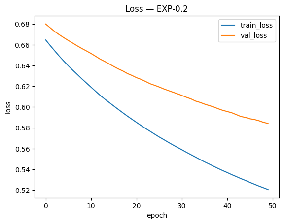

**Confusion matrix**

|  | Predicted Dead | Predicted Survived |
|---|---|---|
| **Actual Dead** | 89 | 17 |
| **Actual Survived** | 55 | 18 |

---
### Run EXP-0.3

**Config**
- Hidden layers: [2]
- Activation: relu
- Optimizer: sgd
- Epochs: 50
- Batch size: 32

**Results**
- Train accuracy: 0.622
- Test accuracy: 0.592
- Precision: 0.000
- Recall: 0.000
- F1: 0.000

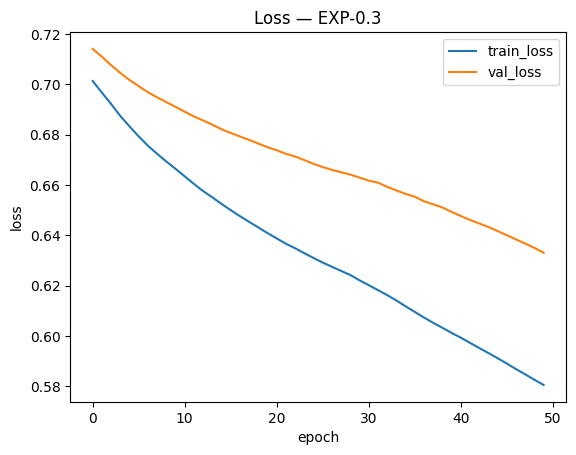

**Confusion matrix**

|  | Predicted Dead | Predicted Survived |
|---|---|---|
| **Actual Dead** | 106 | 0 |
| **Actual Survived** | 73 | 0 |

**Observation:** The results are not very consisten. I assume this is because the width of the network is quite narrow. So that will be the next step.

---

## EXP-1
I am going to increase the width by doubling it every time and looking at the results if i can identify an improvment in accuracy

### Run EXP-1.1

**Config**
- Hidden layers: [4]
- Activation: relu
- Optimizer: sgd
- Epochs: 50
- Batch size: 32

**Results**
- Train accuracy: 0.834
- Test accuracy: 0.777
- Precision: 0.811
- Recall: 0.589
- F1: 0.683

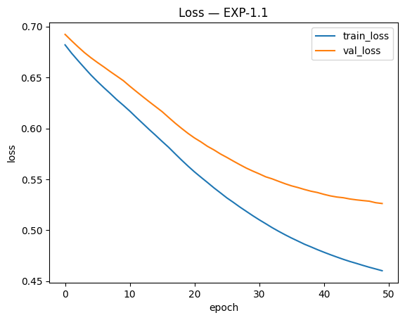

**Confusion matrix**

|  | Predicted Dead | Predicted Survived |
|---|---|---|
| **Actual Dead** | 96 | 10 |
| **Actual Survived** | 30 | 43 |

**Observation:** Definatley an improvement i am going to continue

---
### Run EXP-1.2

**Config**
- Hidden layers: [8]
- Activation: relu
- Optimizer: sgd
- Epochs: 50
- Batch size: 32

**Results**
- Train accuracy: 0.789
- Test accuracy: 0.737
- Precision: 0.760
- Recall: 0.521
- F1: 0.618

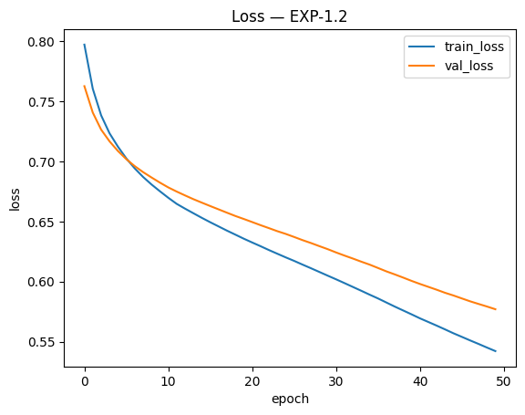

**Confusion matrix**

|  | Predicted Dead | Predicted Survived |
|---|---|---|
| **Actual Dead** | 94 | 12 |
| **Actual Survived** | 35 | 38 |

**Observation:** i think the loss will go down further. I will continue

---
### Run EXP-1.3

**Config**
- Hidden layers: [16]
- Activation: relu
- Optimizer: sgd
- Epochs: 50
- Batch size: 32

**Results**
- Train accuracy: 0.815
- Test accuracy: 0.765
- Precision: 0.763
- Recall: 0.616
- F1: 0.682

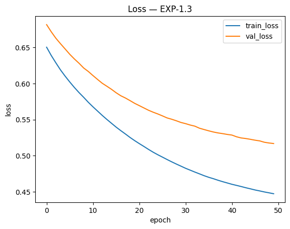

**Confusion matrix**

|  | Predicted Dead | Predicted Survived |
|---|---|---|
| **Actual Dead** | 92 | 14 |
| **Actual Survived** | 28 | 45 |

**Observation:** The loss curve is still dropping. I will doubble the width agian

---
### Run EXP-1.4

**Config**
- Hidden layers: [32]
- Activation: relu
- Optimizer: sgd
- Epochs: 50
- Batch size: 32

**Results**
- Train accuracy: 0.822
- Test accuracy: 0.743
- Precision: 0.765
- Recall: 0.534
- F1: 0.629

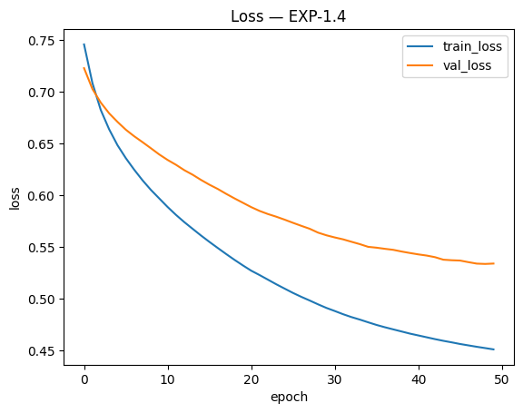

**Confusion matrix**

|  | Predicted Dead | Predicted Survived |
|---|---|---|
| **Actual Dead** | 94 | 12 |
| **Actual Survived** | 34 | 39 |

**Observation:** I have the feeling the curve is slowly evening out. I will double again to check if it evens out more or even starts climbing agin

---
### Run EXP-1.5

**Config**
- Hidden layers: [64]
- Activation: relu
- Optimizer: sgd
- Epochs: 50
- Batch size: 32

**Results**
- Train accuracy: 0.836
- Test accuracy: 0.788
- Precision: 0.843
- Recall: 0.589
- F1: 0.694

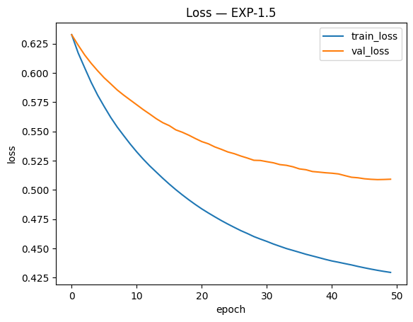

**Confusion matrix**

|  | Predicted Dead | Predicted Survived |
|---|---|---|
| **Actual Dead** | 98 | 8 |
| **Actual Survived** | 30 | 43 |

**Observation:** The validation loss slowly flattens out more or even barly climbes. I will try one more to confirm

---
### Run EXP-1.6

**Config**
- Hidden layers: [128]
- Activation: relu
- Optimizer: sgd
- Epochs: 50
- Batch size: 32

**Results**
- Train accuracy: 0.836
- Test accuracy: 0.777
- Precision: 0.824
- Recall: 0.575
- F1: 0.677

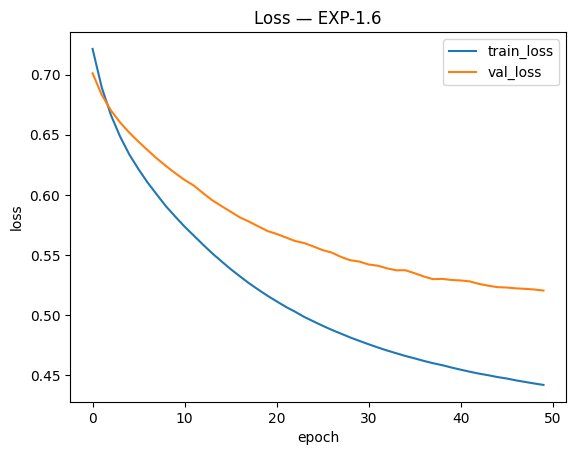

**Confusion matrix**

|  | Predicted Dead | Predicted Survived |
|---|---|---|
| **Actual Dead** | 97 | 9 |
| **Actual Survived** | 31 | 42 |

**Observation:** I am actually unsure about this. But one thing is definatly shure it did not really improve compared to the 1.5 Run so I will stick with the width of 64.

---
## EXP-2
Now i will start to slowly add debth to the network. I will add one by one hidden layer. I will also try out reducing the width in the deeper layers

### Run EXP-2.1

**Config**
- Hidden layers: [64, 64]
- Activation: relu
- Optimizer: sgd
- Epochs: 50
- Batch size: 32

**Results**
- Train accuracy: 0.837
- Test accuracy: 0.793
- Precision: 0.833
- Recall: 0.616
- F1: 0.709

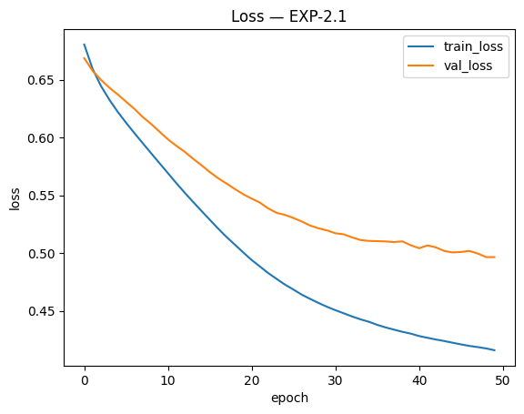

**Confusion matrix**

|  | Predicted Dead | Predicted Survived |
|---|---|---|
| **Actual Dead** | 97 | 9 |
| **Actual Survived** | 28 | 45 |

**Observation:** I can definatley see a small improvement. I will add one more hidden layer. 

---
### Run EXP-2.2

**Config**
- Hidden layers: [64, 64, 64]
- Activation: relu
- Optimizer: sgd
- Epochs: 50
- Batch size: 32

**Results**
- Train accuracy: 0.838
- Test accuracy: 0.765
- Precision: 0.830
- Recall: 0.534
- F1: 0.650

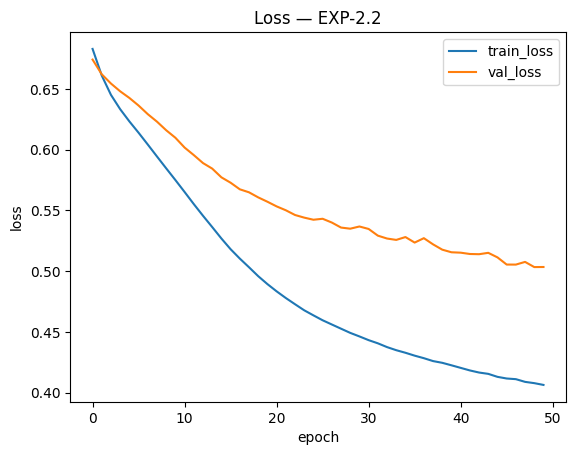

**Confusion matrix**

|  | Predicted Dead | Predicted Survived |
|---|---|---|
| **Actual Dead** | 98 | 8 |
| **Actual Survived** | 34 | 39 |

**Observation:** Test accuracy dropped. however I will validate by adding one more layer (4 )

---
### Run EXP-2.3

**Config**
- Hidden layers: [64, 64, 64, 64]
- Activation: relu
- Optimizer: sgd
- Epochs: 50
- Batch size: 32

**Results**
- Train accuracy: 0.847
- Test accuracy: 0.788
- Precision: 0.818
- Recall: 0.616
- F1: 0.703

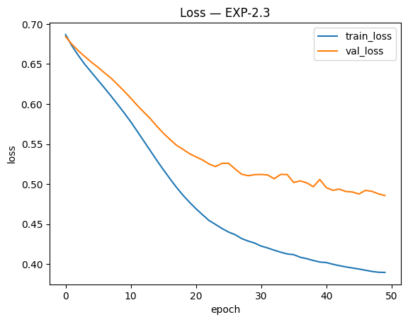

**Confusion matrix**

|  | Predicted Dead | Predicted Survived |
|---|---|---|
| **Actual Dead** | 96 | 10 |
| **Actual Survived** | 28 | 45 |

**Observation:** It has gotten a little bit better. But not a lot. I think at this point it is just overfitting. I will reduce one layer and try narrowing down the layer e.g. [64,32]

---
### Run EXP-2.4

**Config**
- Hidden layers: [64, 32]
- Activation: relu
- Optimizer: sgd
- Epochs: 50
- Batch size: 32

**Results**
- Train accuracy: 0.836
- Test accuracy: 0.788
- Precision: 0.843
- Recall: 0.589
- F1: 0.694

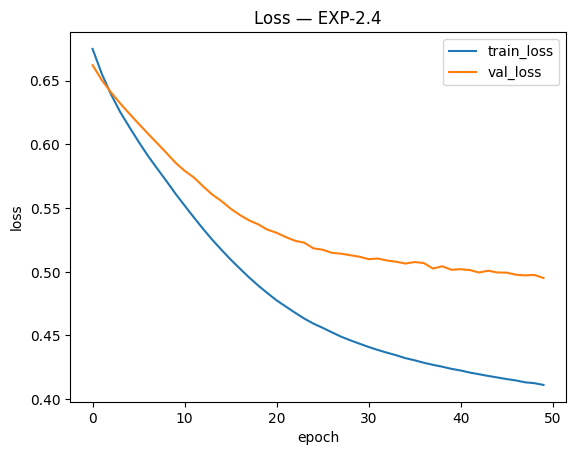

**Confusion matrix**

|  | Predicted Dead | Predicted Survived |
|---|---|---|
| **Actual Dead** | 98 | 8 |
| **Actual Survived** | 30 | 43 |

**Observation:** 2.1 [64,64] remains unbeaten. Just for reference i will try how it performs with [32,32]. In order to validate my earlyer conclusion, that 64 width works better than 32

---
### Run EXP-2.5

**Config**
- Hidden layers: [32, 32]
- Activation: relu
- Optimizer: sgd
- Epochs: 50
- Batch size: 32

**Results**
- Train accuracy: 0.834
- Test accuracy: 0.782
- Precision: 0.827
- Recall: 0.589
- F1: 0.688

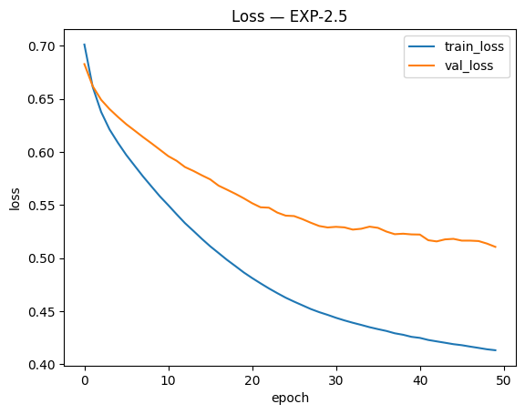

**Confusion matrix**

|  | Predicted Dead | Predicted Survived |
|---|---|---|
| **Actual Dead** | 97 | 9 |
| **Actual Survived** | 30 | 43 |

**Observation:** Up till now the [64,64] hidden layer remains unbeaten

---
## EXP-3
In experiment 3 i will try out several optimiser functions: sgd, adam, rmsprop, adagrad, nadam

### [EXP-3.1](#run-exp-21)
I ran sgd up till now. The corresponding run with the same other parameters as the following

### Run EXP-3.2

**Config**
- Hidden layers: [64, 64]
- Activation: relu
- Optimizer: adam
- Epochs: 50
- Batch size: 32

**Results**
- Train accuracy: 0.862
- Test accuracy: 0.804
- Precision: 0.828
- Recall: 0.658
- F1: 0.733

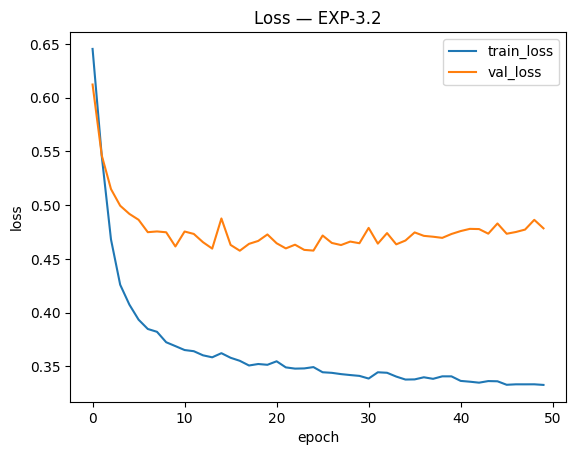

**Confusion matrix**

|  | Predicted Dead | Predicted Survived |
|---|---|---|
| **Actual Dead** | 96 | 10 |
| **Actual Survived** | 25 | 48 |

**Observation:** adam achived bette results than sgd. I also want to point out that it got to a good result in far less epochs. After about 10 epochs it started overfitting

---

### Run EXP-3.3

**Config**
- Hidden layers: [64, 64]
- Activation: relu
- Optimizer: rmsprop
- Epochs: 50
- Batch size: 32

**Results**
- Train accuracy: 0.862
- Test accuracy: 0.799
- Precision: 0.825
- Recall: 0.644
- F1: 0.723

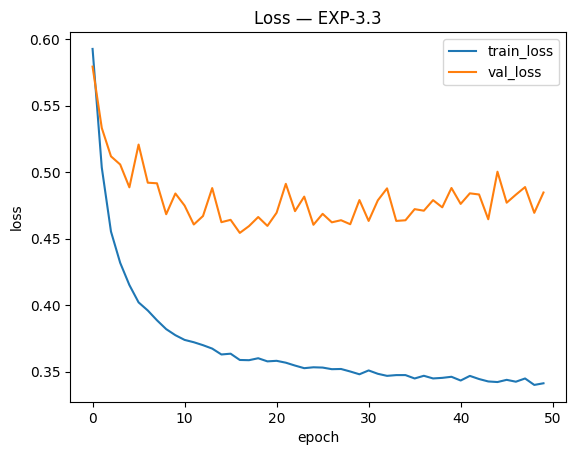

**Confusion matrix**

|  | Predicted Dead | Predicted Survived |
|---|---|---|
| **Actual Dead** | 96 | 10 |
| **Actual Survived** | 26 | 47 |

**Observation:** rmsprop also perfomed better than sgd but not as good as adam

---

### Run EXP-3.4

**Config**
- Hidden layers: [64, 64]
- Activation: relu
- Optimizer: adagrad
- Epochs: 50
- Batch size: 32

**Results**
- Train accuracy: 0.729
- Test accuracy: 0.676
- Precision: 0.857
- Recall: 0.247
- F1: 0.383

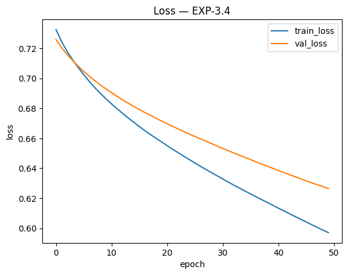

**Confusion matrix**

|  | Predicted Dead | Predicted Survived |
|---|---|---|
| **Actual Dead** | 103 | 3 |
| **Actual Survived** | 55 | 18 |

**Observation:** adagrad performed the worst of all up till now

---
### Run EXP-3.5

**Config**
- Hidden layers: [64, 64]
- Activation: relu
- Optimizer: nadam
- Epochs: 50
- Batch size: 32

**Results**
- Train accuracy: 0.861
- Test accuracy: 0.799
- Precision: 0.803
- Recall: 0.671
- F1: 0.731

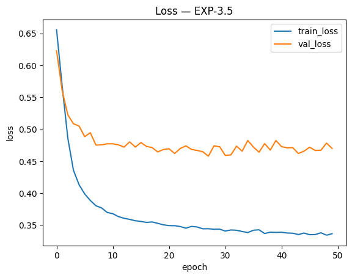

**Confusion matrix**

|  | Predicted Dead | Predicted Survived |
|---|---|---|
| **Actual Dead** | 94 | 12 |
| **Actual Survived** | 24 | 49 |

**Observation:** nadam als performed really good. But not quite as good as adam

---
### EXP-3 Conclusion
out of all the optimizers I tried. adam performed the best.

## EXP-4

## Experiment Results

Please document your training results in this cell. You should document:
- What you tried and what your results and conclusion were.
- Which model performed best.
- What your evaluation of the best model is. Is the result good or bad? Why? In addition to the actual score, please also discuss overfitting.
- Any other observations you made during the experiment.